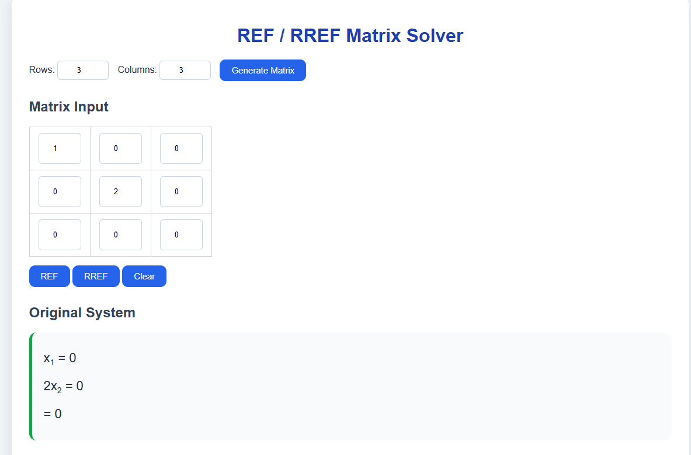

# REF / RREF Matrix Solver



A web-based **Linear Algebra** calculator that computes **Row Echelon Form (REF)** and **Reduced Row Echelon Form (RREF)** while displaying every elementary row operation used throughout the solution.

The goal of this project is not only to compute the final answer, but also to help students understand the complete Gaussian Elimination and Gauss-Jordan Elimination process.

---

# Technologies

- HTML5
- CSS3
- Vanilla JavaScript

No external libraries or frameworks are required.

---

# Features

- Dynamic matrix generation
- Custom number of rows and columns
- REF Solver
- RREF Solver
- Step-by-step solution
- Original system of equations
- Final solution display
- Pivot highlighting
- Leading 1 highlighting
- Responsive interface

---

# How to Use

1. Select the number of rows.
2. Select the number of columns.
3. Click **Generate Matrix**.
4. Enter the matrix values.
5. Click **REF** or **RREF**.
6. View:
   - Original System
   - Result Matrix
   - Final Solution
   - Complete Calculation Steps

---

# REF and RREF Conditions

Before using the calculator, it is useful to understand the mathematical definitions of **REF** and **RREF**.

## What is a Pivot?

A **pivot** (also called a **leading entry**) is the first non-zero number in a row.

Example

```text
1 4 5
0 2 6
0 0 3
```

The pivots are:

- Row 1 → 1
- Row 2 → 2
- Row 3 → 3

In RREF, every pivot becomes **1**.

---

## Elementary Row Operations

The calculator only uses the three elementary row operations.

### 1. Swap two rows

```text
Ri ↔ Rj
```

Example

```text
R1 ↔ R2
```

---

### 2. Multiply a row by a non-zero constant

```text
Ri ← kRi
```

Example

```text
R2 ← (1/3)R2
```

---

### 3. Add or subtract a multiple of another row

```text
Ri ← Ri + kRj
```

or

```text
Ri ← Ri − kRj
```

Example

```text
R3 ← R3 − 2R1
```

---

# Row Echelon Form (REF)

A matrix is in **REF** if it satisfies all of the following conditions.

### 1. All zero rows appear at the bottom.

Example

```text
1 2 3
0 4 5
0 0 0
```

---

### 2. Every pivot is to the right of the pivot above it.

Correct

```text
1 2 3
0 1 4
0 0 5
```

Incorrect

```text
1 2 3
0 0 5
0 4 6
```

---

### 3. Every value below each pivot equals zero.

Correct

```text
1 2 3
0 4 5
0 0 6
```

---

# Reduced Row Echelon Form (RREF)

A matrix is in **RREF** if:

- It satisfies all REF conditions.
- Every pivot equals **1**.
- Every pivot is the only non-zero value in its column.

Correct

```text
1 0 5
0 1 3
```

Incorrect

```text
1 2 5
0 1 3
```

---

# How the Algorithms Work

## REF Algorithm

### Step 1 — Find the Pivot

Search the current column for the first non-zero value.

If necessary, swap rows.

Example

```text
0 2 3
1 4 5
```

↓

```text
1 4 5
0 2 3
```

Operation

```text
R₁ ↔ R₂
```

---

### Step 2 — Eliminate Values Below the Pivot

Formula

```text
Ri = Ri − kRpivot
```

where

```text
k = value below pivot / pivot
```

Example

```text
R₂ = R₂ − 2R₁
```

---

### Step 3 — Move to the Next Pivot

Repeat until the matrix reaches REF.

---

# RREF Algorithm

### Step 1 — Convert to REF

The algorithm first performs Gaussian Elimination.

---

### Step 2 — Normalize Pivot Rows

Every pivot is divided by itself so it becomes **1**.

Example

```text
2 4
0 3
```

↓

```text
1 2
0 1
```

---

### Step 3 — Eliminate Above Every Pivot

Example

```text
1 3
0 1
```

↓

```text
R₁ = R₁ − 3R₂
```

↓

```text
1 0
0 1
```

---

# Example Workflow

Input

```text
1 2 3
2 5 8
```

↓

REF

```text
1 2 3
0 1 2
```

↓

RREF

```text
1 0 -1
0 1  2
```

↓

Solution

```text
x₁ = -1
x₂ = 2
```

---

# Project Structure

```text
rref_calculator/
│
├── index.html
├── style.css
├── script.js
│
├── assets/
│   └── img/
│       └── matrix.png
│
└── README.md
```

---

# JavaScript Logic

## createMatrix()

Creates the matrix dynamically based on the selected dimensions.

---

## getMatrix()

Reads all user inputs and converts them into a JavaScript 2D array.

---

## REF(matrix)

Responsibilities:

- Find pivots
- Swap rows
- Eliminate entries below pivots
- Save every step

---

## RREF(matrix)

Responsibilities:

- Call `REF()`
- Normalize pivot rows
- Eliminate entries above pivots
- Produce the final reduced matrix

---

## saveStep()

Stores every elementary row operation together with the matrix generated after that operation.

---

# Future Improvements

- Fraction rendering
- LaTeX mathematical notation
- Matrix inverse
- Determinant
- Rank
- Null Space
- Column Space
- Matrix multiplication
- Matrix addition
- Matrix subtraction
- Matrix transpose
- LU Decomposition
- QR Decomposition
- Eigenvalues
- Eigenvectors
- Vector operations
- Linear system solver
- Export as PDF
- Dark Mode

---

# Purpose

This project was developed as an educational tool for learning **Linear Algebra**.

Instead of displaying only the final answer, the calculator shows every elementary row operation, making it easier to understand how Gaussian Elimination and Gauss-Jordan Elimination work.